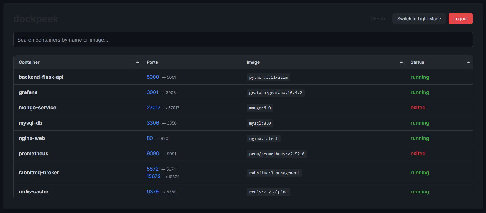

# dockpeek

**dockpeek** is a lightweight web-based dashboard for quickly checking the status and port mappings of your Docker containers. It provides a simple interface to monitor your Dockerized services.

---

## ✨ Key Features

-   **Port Mapping Visibility**: Clearly see host ports and their corresponding container ports, simplifying service access and networking.
-   **Container Overview**: Get a quick glance at all your Docker containers.
-   **Basic Authentication**: A simple username/password login secures access to your dashboard.
-   **Secure Docker Socket Access**: Utilizes a secure proxy (socket-proxy) for Docker API communication, limiting `dockpeek`'s permissions to only essential read-only operations.

---

## 📸 Screenshots

<p align="left">
  
</p>

---

## Installation & Usage
💡 Deployment Options

`dockpeek` can be deployed in two ways. **It is strongly recommended to use the configuration with `socket-proxy` due to enhanced security.**

#### Recommended Configuration (with `socket-proxy`)

This configuration is recommended as it utilizes the `socket-proxy` container as a secure intermediary for accessing the Docker daemon. `socket-proxy` limits `dockpeek`'s permissions exclusively to essential read-only operations (e.g., viewing containers and images), thereby minimizing potential security risks.

```yaml
services:
  dockpeek:
    image: ghcr.io/dockpeek/dockpeek:latest
    container_name: dockpeek
    environment:
      - SECRET_KEY=my_secret_key # <--- REQUIRED CHANGE TO A UNIQUE VALUE!
      - USERNAME=admin         # <--- REQUIRED CHANGE!
      - PASSWORD=admin         # <--- REQUIRED CHANGE!
      - DOCKER_HOST=tcp://socket-proxy:2375
    ports:
      - "3420:8000"
    depends_on:
      - socket-proxy
    restart: unless-stopped

  socket-proxy:
    image: lscr.io/linuxserver/socket-proxy:latest
    container_name: socket-proxy
    environment:
      - CONTAINERS=1 # Enables access to Container API
      - IMAGES=1     # Enables access to Image API
      - PING=1
      - VERSION=1
      - LOG_LEVEL=info
    volumes:
      - /var/run/docker.sock:/var/run/docker.sock:ro 
    read_only: true
    tmpfs:
      - /run
    ports:
      - "2375:2375"
    restart: unless-stopped

```

#### Alternative Configuration (without `socket-proxy` - **NOT RECOMMENDED!**)

This configuration is simpler but carries significant security risks, as `dockpeek` gains full access to the host's Docker daemon.

```yaml
services:
  dockpeek:
    image: ghcr.io/dockpeek/dockpeek:latest
    container_name: dockpeek
    environment:
      - SECRET_KEY=my_secret_key # <--- REQUIRED CHANGE TO A UNIQUE VALUE!
      - USERNAME=admin         # <--- REQUIRED CHANGE!
      - PASSWORD=admin         # <--- REQUIRED CHANGE!
    ports:
      - "3420:8000"
    volumes:
      - /var/run/docker.sock:/var/run/docker.sock
    restart: unless-stopped
```