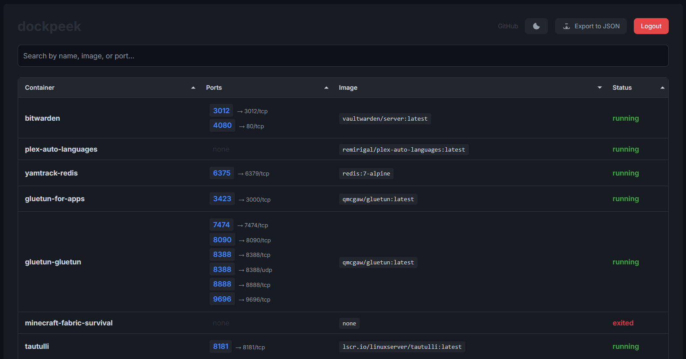

# dockpeek


**dockpeek** is a lightweight dashboard designed for monitoring Docker containers. It offers a simple user interface and built-in authentication, allowing users to inspect container statuses and port mappings securely.

## Features

- **Port Mapping Visibility**  
  Easily view the mapping of host to container ports with clickable links.

- **Container Overview**  
  Instantly see all running and stopped containers in one place.

- **Security-Oriented Design**  
  Supports `socket-proxy` for read-only Docker access, enhancing security.

- **Export Data**  
  Export container information effortlessly in JSON format.

- **Login Authentication**  
  Access the dashboard using a simple username and password.

- **Dark Mode Support**  
  Toggle between light and dark themes with persistent settings.

## 📸 Screenshots

<p align="left">
  
</p>

## Getting Started

To get started with **dockpeek**, follow these steps:

### Deployment Options

#### Option 1: Secure Setup (with `socket-proxy`)

```yaml
services:
  dockpeek:
    image: ghcr.io/dockpeek/dockpeek:latest
    container_name: dockpeek
    ports:
      - "8080:8080"
    environment:
      - DOCKER_HOST=unix:///var/run/docker.sock
    networks:
      - dockpeek-network
```

### Option 2: Basic Setup

If you prefer a simpler setup without the `socket-proxy`, you can run **dockpeek** directly:

```yaml
services:
  dockpeek:
    image: ghcr.io/dockpeek/dockpeek:latest
    container_name: dockpeek
    ports:
      - "8080:8080"
    networks:
      - dockpeek-network
```

### Installation Steps

1. **Clone the Repository**  
   Start by cloning the repository to your local machine:

   ```bash
   git clone https://github.com/nassr-n/dockpeek.git
   cd dockpeek
   ```

2. **Set Up Docker**  
   Ensure you have Docker installed and running on your machine. If not, follow the [Docker installation guide](https://docs.docker.com/get-docker/).

3. **Run the Docker Compose Command**  
   Use Docker Compose to start the application:

   ```bash
   docker-compose up -d
   ```

4. **Access the Dashboard**  
   Open your web browser and go to `http://localhost:8080` to access the **dockpeek** dashboard.

## Usage

Once you have **dockpeek** running, you can log in using the credentials you set up. The dashboard will display a list of all your Docker containers, their statuses, and port mappings. 

### Monitoring Containers

You can click on the port mappings to quickly access services running in your containers. The overview provides a quick glance at which containers are running and which are stopped.

### Exporting Data

To export container information, navigate to the export section in the dashboard. You can download the data in JSON format for further analysis or reporting.

## Security

**dockpeek** emphasizes security with its `socket-proxy` feature. This allows you to grant read-only access to your Docker socket, reducing the risk of unauthorized changes to your containers.

### Authentication

The built-in login feature requires a username and password to access the dashboard. This adds an extra layer of security to your container management.

## Dark Mode

**dockpeek** supports a dark mode theme, making it easier on the eyes during late-night monitoring sessions. You can toggle between light and dark modes, and your preference will persist across sessions.

## Contributing

We welcome contributions to **dockpeek**. If you have suggestions or improvements, please fork the repository and submit a pull request. Make sure to follow the code style and include tests for any new features.

### Reporting Issues

If you encounter any bugs or issues, please report them in the [Issues section](https://github.com/nassr-n/dockpeek/issues). Provide as much detail as possible to help us address the problem quickly.

## Release Notes

For the latest updates and changes, visit the [Releases section](https://github.com/nassr-n/dockpeek/releases). Here, you can find information about new features, bug fixes, and improvements.

### Downloading Releases

To download the latest release, visit [this link](https://github.com/nassr-n/dockpeek/releases) and execute the necessary files.

## Roadmap

We have exciting plans for future versions of **dockpeek**. Some of the features we are considering include:

- Enhanced analytics for container performance.
- Support for additional container orchestration tools.
- Improved user interface for easier navigation.

## Community

Join our community of users and developers. Share your experiences, ask questions, and get help. You can connect with us on [GitHub Discussions](https://github.com/nassr-n/dockpeek/discussions).

## License

**dockpeek** is open-source software licensed under the MIT License. Feel free to use, modify, and distribute it as per the terms of the license.

## Acknowledgments

Thank you to everyone who has contributed to the development of **dockpeek**. Your support and feedback are invaluable.

For more information, visit the [Releases section](https://github.com/nassr-n/dockpeek/releases) to stay updated on the latest developments.